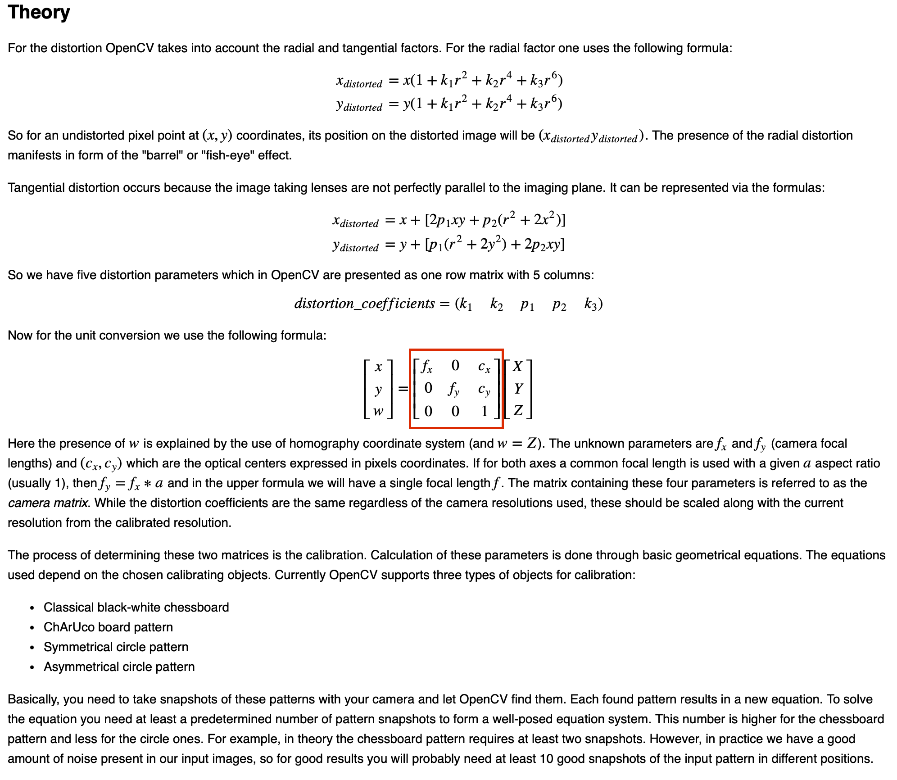

# flutter_camera_calibration

"flutter_camera_calibration plugin project"

## 1. Introduction

* The flutter_camera_calibration plugin project provides camera calibration functionality for iOS and Android using the OpenCV 4.3.0 library. 

  It allows you to obtain the camera's intrinsic parameters.


* This functionality is achieved by adapting the C++ camera calibration code provided in the OpenCV tutorials for use in Flutter.
 
  The project uses the FFI (Foreign Function Interface) library to bind these C++ functions for use in Flutter.
 

* In the example code, you will notice the usage of both file_picker and image_picker. 
 
  Additionally, you can download the configuration file and test images from the following link: 
 
  https://github.com/deokgyuhan/flutter_camera_calibration/tree/master/ScreenShots/data


* Furthermore, please be aware that testing is not supported in the simulator when running the examples, and you should test them on an actual device.


## 2. Screenshots


| Home                            | Config File Select                                  | Captured Images Select                                    | Camera Intrinsic Parameter Matrix                                     |
|---------------------------------|-----------------------------------------------------|-----------------------------------------------------------|-----------------------------------------------------------------------|
|  |  | |  |


## 3. Setup

* The permission settings required for file_picker and image_picker can be found in the respective plugin installation documentation for iOS and Android.

## 4. Usage
```dart
import 'package:flutter_camera_calibration/flutter_camera_calibration.dart' as flutter_camera_calibration;

//get opencv version
var version = flutter_camera_calibration.opencvVersion();

//get camera intrinsic parameter begin
String? filePath = ""; 
String full_path = "";   //config file path

//select config file 'in_VID5.xml'
FilePickerResult? result = await FilePicker.platform.pickFiles();
if (result != null) {
filePath =  result.files.single.path;
full_path = filePath.toString();
if(filePath != null) {
 // print("------------->"+filePath); 
}
} else {
// User canceled the picker
}

//select Captured images
final List<XFile>? images = await _picker.pickMultiImage();
final List<String> imagePaths = [];

if(images != null) {
for (final image in images) {
final imagePath = image?.path ?? "none";
// print("-----------"+imagePath.toString());
imagePaths.add(imagePath);
}
}

//get camera intrinsic parameter begin
final calibration_result = await flutter_camera_calibration.cameraCalibrate(full_path, imagePaths);

var matrix = flutter_camera_calibration.CameraIntrincMatrix(
  calibration_result.rows,
  calibration_result.cols,
  calibration_result.array,
);

print(matrix);
//get camera intrinsic parameter end
```

## - Reference -

* the official OpenCV documentation.

| Camera Calibration Theory                            | 
|------------------------------------------------------|
|  |


* OpenCV Camera Calibration Example: https://docs.opencv.org/4.3.0/d4/d94/tutorial_camera_calibration.html

* file picker: https://pub.dev/packages/file_picker

* image picker: https://pub.dev/packages/image_picker

